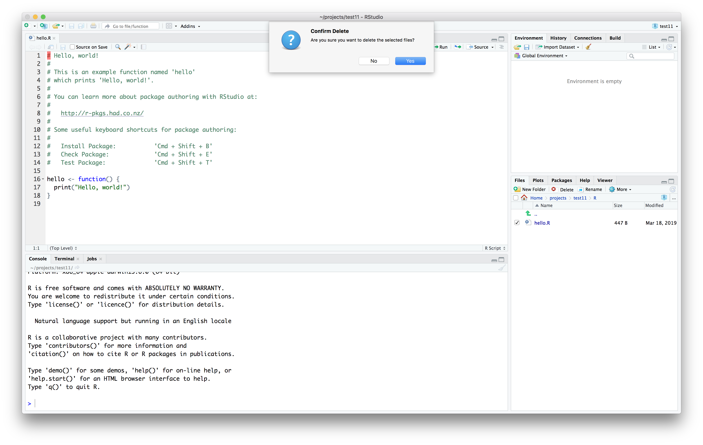
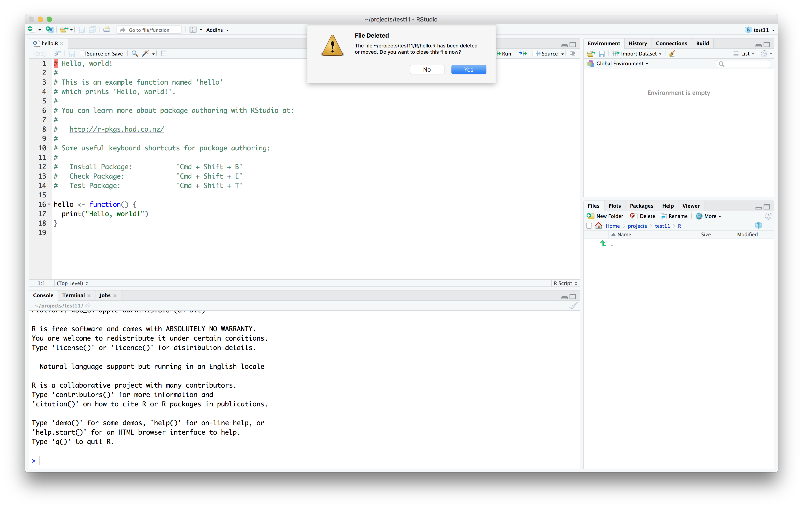
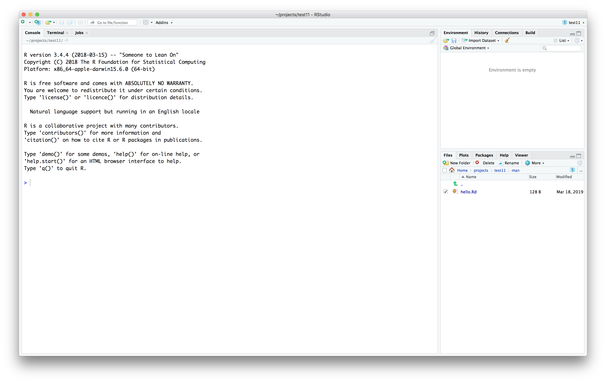
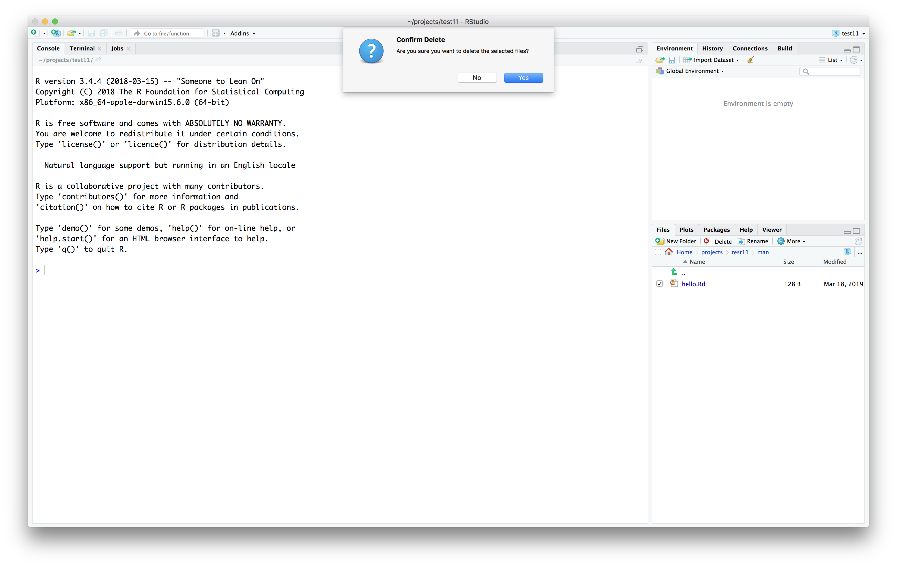
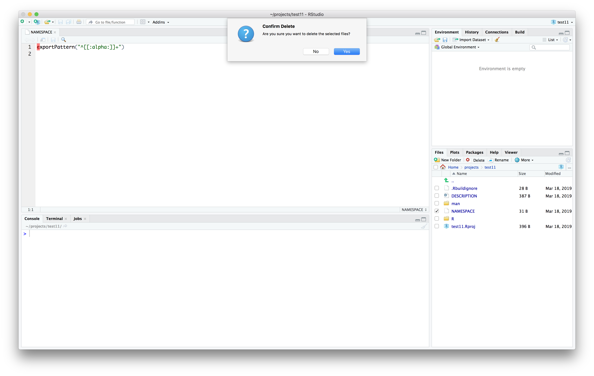
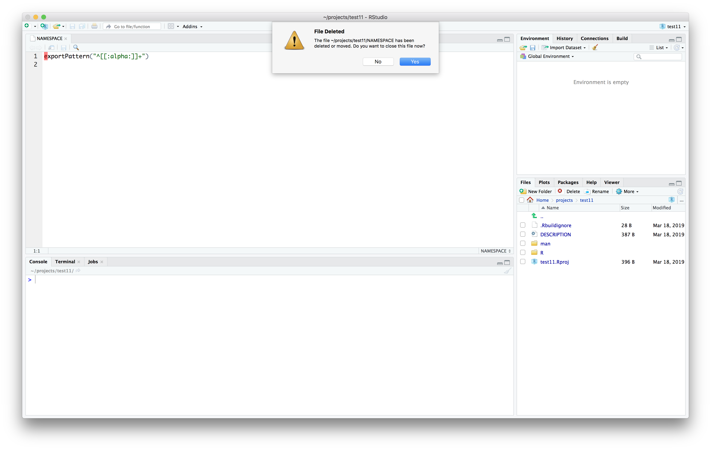
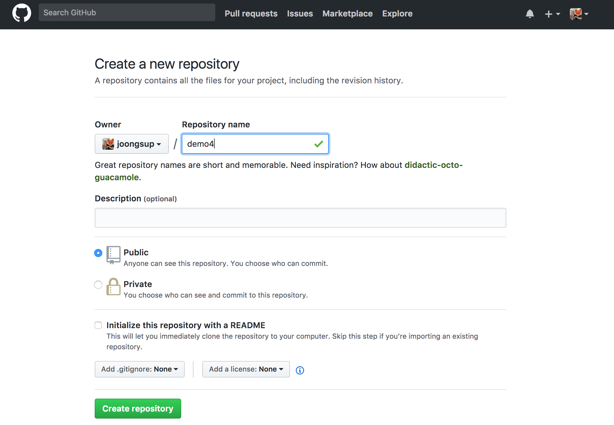

```{r setup, include=FALSE}
options(htmltools.dir.version = FALSE)
library(knitr)
```


# Motivation

```{r, fig.width = 6, fig.height = 4}
library(ggplot2)
ggplot(data = mtcars) +
    geom_bar(aes(x = factor(cyl), fill = factor(gear)))

```


---


# Code/Function Reuse

- Copy and paste from existinig code snippets

- source("path/to/commonly/used/functions.R")

- .Rprofile

- library(my_awesome_pkg)

---
# Cheet Sheet

- Create an R package Project from RStudio

- Change project options to use roxygen2

- Delete R/hello.R, man/hello.Rd, and (default) NAMESPACE

- Iterate through: write/load/document/check/install

- Build source and share

---

class: center, middle

# R Package Development Screenshots

---

## Create a new R project
.center[]

---
## New Directory
.center[]

---
## New R Package
.center[]

---
## Naming is hard but fun!
.center[]

---
## Naming is hard but fun!
.center[]

---
## Hello World!
.center[]

---
## Bye World!
.center[]

---
## Bye World!
.center[]

---
## Bye World!
.center[]

---
## Bye World!
.center[]

---
## Bye (Default) NAMESPACE!
.center[]

---
## Bye (Default) NAMESPACE!
.center[]

---
## Change Project Options
.center[]

---
## Check Roxygen
.center[]

---
## Roxygen Option Not Available?

- install.packages("roxygen2")

- Save and restart RStudio Project (optional)

- Return to Project Option

---
## Check Roxygen
.center[]


---
## Check Roxygen
.center[]

---
## Write R Functions
.center[]

---
## Write R Functions
.center[]

---

## Load All Functions (cmd-shift-L)
.center[]

---
## Load All Functions (cmd-shift-L)
.center[]

---
## Load All Not Available?

- install.packages("devtools")

- Save and restart RStudio Project

- Return to Build menu

---
## Document
.center[]

---
## Document
.center[]

---
## Generate Documents (cmd-shift-D)
.center[]

---
## Generate Documents (cmd-shift-D)
.center[]


---
## Check (cmd-shift-E)
.center[]

---
## Check Progress
.center[]

---
## Check Warnings
.center[]

---
## Check Warning Fixed
.center[]

---
## Nitpicky Warnings/Notes

- Title Case

- Description period.

- Fix license

- Etc.

---
## Check Warning Fixed
.center[]

---
## Install and Restart (cmd-shift-B)
.center[]

---
## Build Source
.center[]

---
## Build Source
.center[]

---
## Share with coworkers

- Copy zipped source file to a common location

- install.packages("path/to/source", repos = NULL) 
    
---
## Share with Strangers
.center[]

---
## Git Set!
.center[]

---
## Git Pane
.center[]

---
## Create Github Repo
.center[]

---
## Initiate Github Repo
.center[]
---
## First Commit!
.center[]

---
## devtools::install_github
```{r, eval = FALSE}

library(devtools)
devtools::install_github("joongsup/demor")
library(demor)
demor_ht(mtcars)

```

---

class: center, middle

# Thanks!
