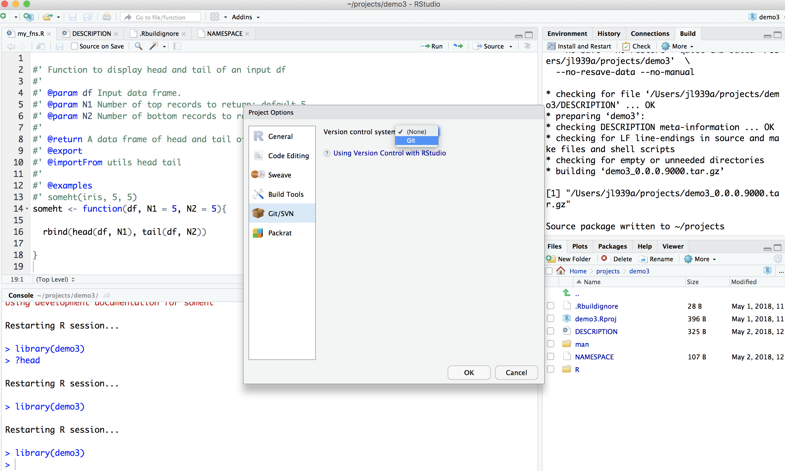

```{r setup, include=FALSE}
options(htmltools.dir.version = FALSE)
library(knitr)
```

class: center, middle

# R Package Development Screenshots

---

## Create a new R project
.center[]

---
## New Directory
.center[]

---
## New R Package
.center[]

---
## Naming is hard but fun!
.center[]

---
## Naming is hard but fun!
.center[]

---
## Hello World!
.center[]

---
## Change Project Options
.center[]

---
## Check Roxygen
.center[]

---
## Check Roxygen
.center[]

---
## Check Roxygen
.center[]

---
## Write R Functions
.center[]

---
## Write R Functions
.center[]

---

## Load All Functions (cmd-shift-L)
.center[]

---
## Load All Functions (cmd-shift-L)
.center[]

---
## Document
.center[]

---
## Document
.center[]

---
## Generate Documents (cmd-shift-D)
.center[]

---
## Generate Documents (cmd-shift-D)
.center[]

---
## Bye World!
.center[]

---
## Install and Restart (cmd-shift-B)
.center[]

---
## Check (cmd-shift-E)
.center[]

---
## Check Progress
.center[]

---
## Check Warnings
.center[]

---
## Check Warning Fixed
.center[]

---
## Check Warning Fixed
.center[]

---
## Build Source
.center[]

---
## Build Source
.center[]


---
## Set up Git
.center[]

---
## Git Set!
.center[]

---
## Git Pane
.center[]

---
## First Commit!
.center[]

---
class: center, middle

# Thanks!

Slides created via the R package [**xaringan**](https://github.com/yihui/xaringan).
