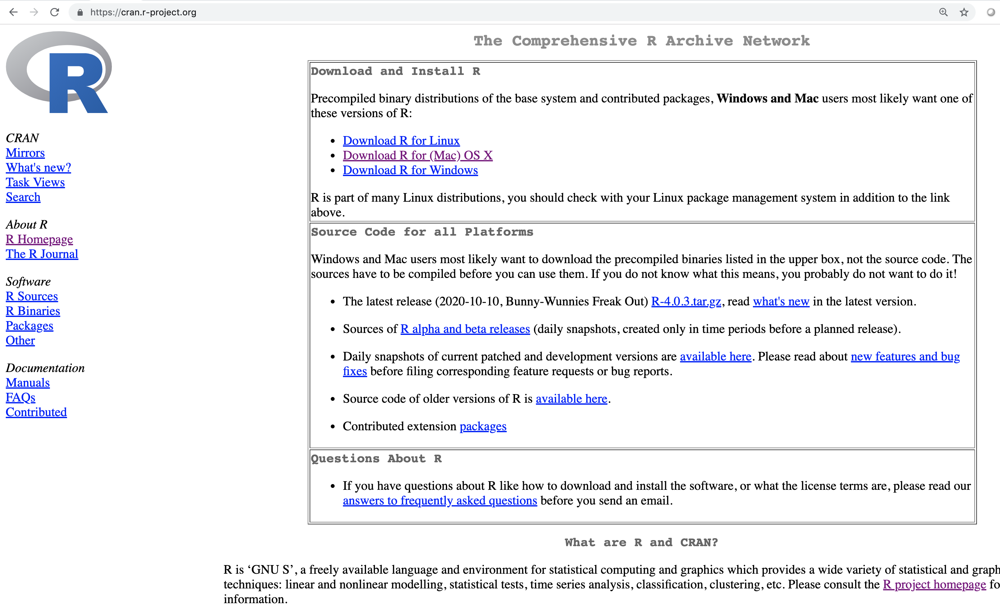
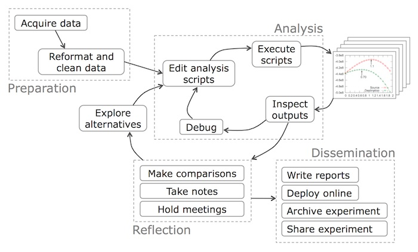

```{r setup, include=FALSE}
options(htmltools.dir.version = FALSE)
library(knitr)
knitr::opts_chunk$set(fig.retina = 3, warning = FALSE, message = FALSE)

# for pdf output format, print (cmd+p) presentation file (html) to pdf
# instead of rendering directly to pdf from .Rmd

# abstract
# In this applied mathematics in industry seminar, a seasoned data scientist with applied mathematics background shares one or two things he wish he had learned in school that he feels should be helpful to both aspiring analytics professionals in industry and future researchers in labs. 

# bio
# Jay Lee is a data scientist with over 10 years of experience in technology, logistics, and federal government. Before working as a data scientist, he served in the US Army, studied mathematical decision science at UNC and obtained a PhD in industrial engineering from Georgia Tech. He likes to talk about data science workflow, education, and UNC hoops, and intermittently blogs at https://joongsup.rbind.io.


```


class: inverse, center, middle

# Views my own, not of employer

---

# Introduction


- US Army (Automated Logistical Specialist) `-->` Database (Data Entry)

- UNC (BS in Mathematical Decision Science) `-->` Matlab

- New York Life Insurance (Actuarial Intern) `-->` Excel (Shortcut), Database (Query)

- Georgia Tech (MS/PhD in Industrial Engineering) `-->` Matlab

- EPA (Physical Scientist Intern) `-->` Database (MS Access)

- UPS (Security Analyst in Corp. Security) `-->` R (Plotting), Database (Data Warehouse)

- AT&T (Data Scientist in Chief Data Office) `-->` R (Packaging), Python, Big Data

---

# Motivation

.right-plot[
```{r, cran-screenshot, echo = FALSE, out.width = '100%'}

```
]

- [CRAN](https://cran.r-project.org/)

- install.packages(["ggplot2"](https://cran.r-project.org/web/packages/ggplot2/index.html))

- R package development workshop in 2017

- [uncmbb](https://cran.r-project.org/web/packages/uncmbb/index.html) package on CRAN

- [The Carpentries](https://software-carpentry.org/lessons/)

- Analytical mindset

- Know and sharpen your tools

- Things I wish I had learned in school

- Introductory by design, not comprehensive

---

class: inverse, center, middle

# Add Survey Result

---

# Operating System

- Mainly for Windows users

- Local Machine (e.g., your computer) vs. Remote Server (e.g., school computing server)

- Know there are other [operating systems](https://en.wikipedia.org/wiki/Operating_system)

- Play with other operating systems (mainly [Linux](https://en.wikipedia.org/wiki/Linux)) 

- There are many [flavors](https://en.wikipedia.org/wiki/List_of_Linux_distributions) of Linux, but don't be discouraged! ([Ubuntu](https://ubuntu.com/download/desktop) is just fine)

- Windows Subsystem for Linux ([WSL](https://docs/microsoft.com/en-us/windows/wsl/about))

- Try ([Virtual Box](https://www.virtualbox.org/), [USB boot](https://ubuntu.com/tutorials/create-a-usb-stick-on-windows#1-overview))

---

# Shell


- [Terminal](https://en.wikipedia.org/wiki/Terminal_emulator)
    - Really, a terminal *emulator*
    - A graphical window
    - Lets you interact with your operating system through shell


- [Shell](https://swcarpentry.github.io/shell-novice/01-intro/index.html)
    - Command line interface (CLI)
    - Scripting/programming language
    - Bash ("**B**ourne **a**gain **sh**ell") is default for many OS


- Terminal `-->` Shell `-->` Operating System

- Search path

- Files, files, and more files

- Project directory structure

- Easier in action than in text

---

# Text Files

- Most work in shell is text-based


- A variety of text editors
    - [Vim](https://en.wikipedia.org/wiki/Vim_(text_editor)
    - [Emacs](https://en.wikipedia.org/wiki/Emacs)
    - [Notepad/Notepad++](https://notepad-plus-plus.org/)
    - [Visual Studio Code](https://code.visualstudio.com/)
    - [Sublime](https://www.sublimetext.com/)
    - [RStudio](https://rstudio.com/)
    - [And more](https://en.wikipedia.org/wiki/Text_editor)


- Pick a text editor and try using it for any text-based tasks 
    - Coding
    - [Note taking](https://github.com/vimwiki/vimwiki)
    - [Presentation](https://github.com/yihui/xaringan)


- How to write in a text editor? `-->` check out [R Markdown](https://rmarkdown.rstudio.com/)

---

# Languages of Data Science

- [R](https://www.r-project.org/) or [Python](https://www.python.org/)? Both!
    - "R is a language and environment for statistical computing and graphics"
    - "Python is a programming language that lets you work quickly and integrate systems more effectively"


- Plotting
    - Bar chart
    - Line chart
    - Covers majority of plotting needs


- Packaging
    - [R Package](https://r-pkgs.org/)
    - [Python Package](https://py-pkgs.org/) 
    - Start w/ data package ([babynames](https://cran.r-project.org/web/packages/babynames/index.html), [uncmbb](https://cran.r-project.org/web/packages/uncmbb/index.html))


- And everything between plotting and packaging

---

# Data Example

```{r, data-head}
#install.packages("uncmbb") # if not already installed
library(uncmbb)
tail(unc)
tail(duke)
```

---

# Bar Chart Example

.left-code[
```{r label = "barplot-last", eval = FALSE}
library(uncmbb)
library(dplyr)
library(ggplot2)

# prepare data for plotting #<<
dat <- unc %>% filter(Season >= 2005) %>%
               group_by(Result) %>%
               summarize(games = n())

# plot aggregated data #<<
dat %>% ggplot(aes(x = Result, y = games)) +
        geom_bar(stat = "identity") +
        labs(title = "UNC Win/loss since 2005")
```
]

.right-plot[
```{r ref.label = "barplot-last", echo = FALSE}
```
]

---

# Line Chart Example

.left-code[
```{r label = "lineplot-last", eval = FALSE}
library(uncmbb)
library(dplyr)
library(ggplot2)

# prepare data for plotting #<<
dat <- unc %>% filter(Season >= 2005) %>%
               group_by(Season) %>%
               summarize(games = n(),
                         wins = sum(Result == "W"),
                         losses = sum(Result == "L"),
                         win_pct = wins/games)

# plot aggregated data #<<
dat %>% ggplot(aes(x = Season, y = win_pct, group = 1)) +
        geom_line() +
        geom_point() +
        geom_smooth(method = "lm", se = FALSE) +
        geom_hline(yintercept = 0.5, 
                   linetype = "dashed", colour = "red") +
        scale_y_continuous(labels = scales::percent) +
        labs(title = "UNC Win % since 2005")

```
]

.right-plot[
```{r ref.label = "lineplot-last", echo = FALSE}
```
]


---

# Data Science Workflow

.right-plot[
```{r, workflow-example, include = TRUE, echo = FALSE, out.width = "100%"}

```
]

- Example data science workflow ([source](https://cacm.acm.org/blogs/blog-cacm/169199-data-science-workflow-overview-and-challenges/fulltext))

- Missing, but important: **Problem Formulation**

- Iterative in nature

- Emphasis on "Analysis" step in school

- More emphasis on other steps in industry

- Team sport aspects
    - Team lead
    - Project managers
    - Data engineers
    - Data scientists
    

---

# Parting Thoughts


- In a nutshell, try
    - Ubuntu
    - Bash shell
    - Text editor
    - Bar/line charts in R/Python
    - Package things up in R/Python
    - Data science workflow


- Other topics that are not covered
    - [Git (version control)](https://swcarpentry.github.io/git-novice/01-basics/index.html)
    - [SQL](https://www.w3schools.com/sql/sql_intro.asp)
    - [Blogging](https://bookdown.org/yihui/blogdown/)
    - Communication
    - Much more...

---

# Links


- OS and Shell
    - [Terminal and Shell](http://www.it.uu.se/education/course/homepage/os/vt18/module-0/shell-and-terminal/)
    - [Carpentries Lesson on Shell](http://swcarpentry.github.io/shell-novice/)
    - [Happy Git and GitHub for the useR](https://happygitwithr.com/)
    - [Data Science at Command Line](https://www.datascienceatthecommandline.com/2e/)
    - [Editor War](https://en.wikipedia.org/wiki/Editor_war)


- Coding
    - [Good Enough Practices in Scientific Computing](https://journals.plos.org/ploscompbiol/article?id=10.1371/journal.pcbi.1005510)
    - [The Carpentries](https://software-carpentry.org/lessons/)
    - [R Packaging using RStudio](https://joongsup.rbind.io/slides/r_pkg_devel?force_isolation=true)
    - [R for Data Science](https://r4ds.had.co.nz/)
    - [What They Forgot To Teach You About R](https://rstats.wtf/index.html)
    - [Python Data Science Handbook](https://jakevdp.github.io/PythonDataScienceHandbook/)
    - [Anaconda Data Science Toolkit](https://www.anaconda.com/products/individual)
    - [Project-Oriented Workflow](https://www.tidyverse.org/blog/2017/12/workflow-vs-script/)


---

class: inverse, center, middle

# Questions?

---

class: right, clear
background-image: url(../img/cat.jpg)
background-size: contain
background-position: left


<br><br>

.font200[Thank You!]

In the future, 

if any of the things in this talk ends up helping you in any way,

please reach out and let me know! 

[`r icon::octicons$mail`](mailto:uncmbbtrivia@gmail.com)
[`r icon::fontawesome$solid$link`](https://joongsup.rbind.io)
[`r icon::fontawesome$brands$linkedin`](https://www.linkedin.com/in/joongsupjaylee/)
[`r icon::fontawesome$brands$twitter`](https://twitter.com/uncmbbtrivia)

For now,

please let me know how the presentation was 

by filling out the survey below!

[`r icon::fontawesome$solid$clipboard`](https://www.surveymonkey.com/r/LNSVJ79)